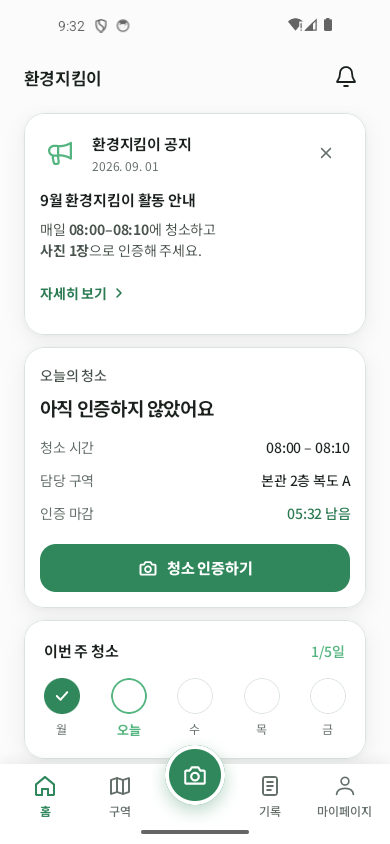
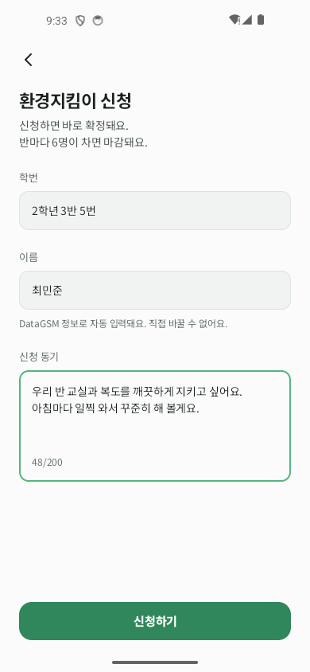
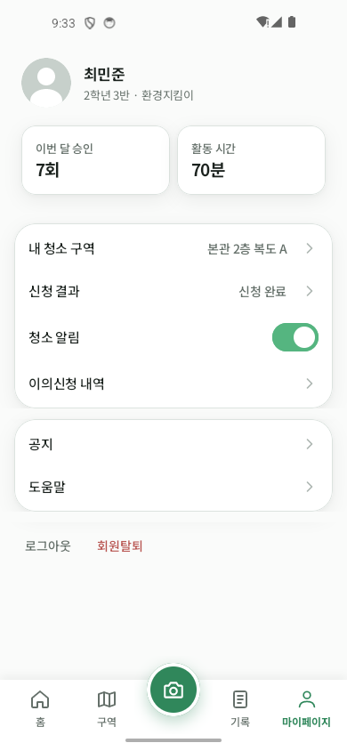
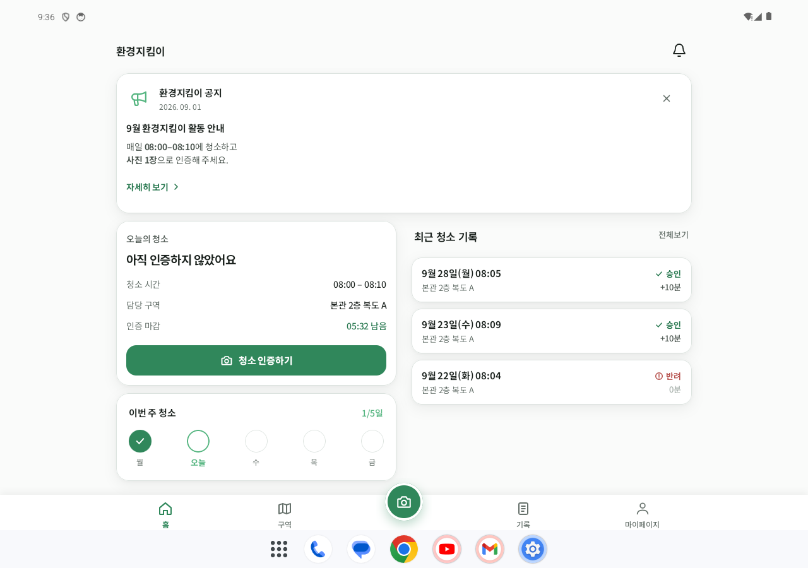
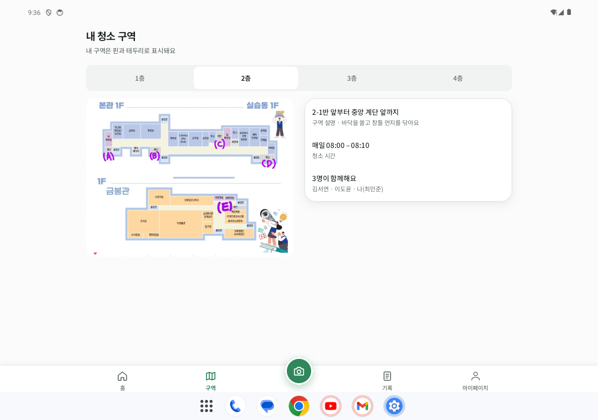

# 리디자인 상태 및 검증

Figma `App Screens · Redesign 2`의 58개 상태를 아래 Preview에 매핑한다. 추가 예시는 모집 홈·모집 로딩·신청 전송 중·내용이 입력된 이의신청으로 총 62개다. 실제 화면 전환·서버 요청·촬영은 이번 정적 UI 작업 범위에 포함하지 않는다.

## 상태 대응표

| Figma 화면 | Android Preview |
|---|---|
| [01 로그인 · 기본 · 823:718](https://www.figma.com/design/Ef8bcly7z4kzYE4D7W9uXU?node-id=823-718) | [LoginScreenPreview](../app/src/main/java/com/nativelap/ecoguard/feature/login/view/LoginScreen.kt) |
| [01 로그인 · 로딩 · 823:777](https://www.figma.com/design/Ef8bcly7z4kzYE4D7W9uXU?node-id=823-777) | [LoginScreenLoadingPreview](../app/src/main/java/com/nativelap/ecoguard/feature/login/view/LoginScreen.kt) |
| [01 로그인 · 실패 · 823:810](https://www.figma.com/design/Ef8bcly7z4kzYE4D7W9uXU?node-id=823-810) | [LoginScreenFailedPreview](../app/src/main/java/com/nativelap/ecoguard/feature/login/view/LoginScreen.kt) |
| [01 스플래시 · 823:750](https://www.figma.com/design/Ef8bcly7z4kzYE4D7W9uXU?node-id=823-750) | [SplashScreenPreview](../app/src/main/java/com/nativelap/ecoguard/feature/login/view/SplashScreen.kt) |
| [01 로그인 · 교사 계정 안내 · 823:2733](https://www.figma.com/design/Ef8bcly7z4kzYE4D7W9uXU?node-id=823-2733) | [TeacherAccountGuideScreenPreview](../app/src/main/java/com/nativelap/ecoguard/feature/login/view/TeacherAccountGuideScreen.kt) |
| [02 홈 · 미제출 · 823:848](https://www.figma.com/design/Ef8bcly7z4kzYE4D7W9uXU?node-id=823-848) | [HomeScreenNotSubmittedPreview](../app/src/main/java/com/nativelap/ecoguard/feature/home/view/HomeScreen.kt) |
| [02 홈 · 검수 중 · 823:997](https://www.figma.com/design/Ef8bcly7z4kzYE4D7W9uXU?node-id=823-997) | [HomeAiReviewingPreview](../app/src/main/java/com/nativelap/ecoguard/feature/home/view/HomeScreen.kt) |
| [02 홈 · 승인 · 823:1124](https://www.figma.com/design/Ef8bcly7z4kzYE4D7W9uXU?node-id=823-1124) | [HomeApprovedPreview](../app/src/main/java/com/nativelap/ecoguard/feature/home/view/HomeScreen.kt) |
| [02 홈 · 반려 · 823:1253](https://www.figma.com/design/Ef8bcly7z4kzYE4D7W9uXU?node-id=823-1253) | [HomeScreenRejectedPreview](../app/src/main/java/com/nativelap/ecoguard/feature/home/view/HomeScreen.kt) |
| [02 홈 · 인증 시간 아님 · 823:2255](https://www.figma.com/design/Ef8bcly7z4kzYE4D7W9uXU?node-id=823-2255) | [HomeOutsideTimePreview](../app/src/main/java/com/nativelap/ecoguard/feature/home/view/HomeScreen.kt) |
| [02 홈 · 선생님 확인 중 · 823:2554](https://www.figma.com/design/Ef8bcly7z4kzYE4D7W9uXU?node-id=823-2554) | [HomeTeacherReviewingPreview](../app/src/main/java/com/nativelap/ecoguard/feature/home/view/HomeScreen.kt) |
| [02 홈 · 신청 완료 후 구역 배정 대기 · 823:3025](https://www.figma.com/design/Ef8bcly7z4kzYE4D7W9uXU?node-id=823-3025) | [HomeScreenWaitingAssignmentPreview](../app/src/main/java/com/nativelap/ecoguard/feature/home/view/HomeScreen.kt) |
| [02 홈 · 조회 실패 · 823:4255](https://www.figma.com/design/Ef8bcly7z4kzYE4D7W9uXU?node-id=823-4255) | [HomeLoadFailedScreenPreview](../app/src/main/java/com/nativelap/ecoguard/feature/home/view/HomeLoadFailedScreen.kt) |
| [02 홈 · 활동 제외 안내 · 823:4449](https://www.figma.com/design/Ef8bcly7z4kzYE4D7W9uXU?node-id=823-4449) | [HomeActivityRemovedScreenPreview](../app/src/main/java/com/nativelap/ecoguard/feature/home/view/HomeActivityRemovedScreen.kt) |
| [02 홈 · 로딩 · 823:4482](https://www.figma.com/design/Ef8bcly7z4kzYE4D7W9uXU?node-id=823-4482) | [HomeLoadingScreenPreview](../app/src/main/java/com/nativelap/ecoguard/feature/home/view/HomeLoadingScreen.kt) |
| [03 모집 공고 · 823:2383](https://www.figma.com/design/Ef8bcly7z4kzYE4D7W9uXU?node-id=823-2383) | [RecruitmentScreenOpenPreview](../app/src/main/java/com/nativelap/ecoguard/feature/recruitment/view/RecruitmentScreen.kt) |
| [03 모집 공고 · 마감 · 823:2923](https://www.figma.com/design/Ef8bcly7z4kzYE4D7W9uXU?node-id=823-2923) | [RecruitmentScreenClosedPreview](../app/src/main/java/com/nativelap/ecoguard/feature/recruitment/view/RecruitmentScreen.kt) |
| [03 모집 공고 · 이미 신청 · 823:2976](https://www.figma.com/design/Ef8bcly7z4kzYE4D7W9uXU?node-id=823-2976) | [RecruitmentScreenAppliedPreview](../app/src/main/java/com/nativelap/ecoguard/feature/recruitment/view/RecruitmentScreen.kt) |
| [03 모집 공고 · 조회 실패 · 823:4350](https://www.figma.com/design/Ef8bcly7z4kzYE4D7W9uXU?node-id=823-4350) | [RecruitmentLoadFailedScreenPreview](../app/src/main/java/com/nativelap/ecoguard/feature/recruitment/view/RecruitmentLoadFailedScreen.kt) |
| [04 환경지킴이 신청 · 입력 전 · 823:2880](https://www.figma.com/design/Ef8bcly7z4kzYE4D7W9uXU?node-id=823-2880) | [ApplicationScreenPreview](../app/src/main/java/com/nativelap/ecoguard/feature/recruitment/view/ApplicationScreen.kt) |
| [04 환경지킴이 신청 · 입력 완료 · 823:4643](https://www.figma.com/design/Ef8bcly7z4kzYE4D7W9uXU?node-id=823-4643) | [ApplicationFilledPreview](../app/src/main/java/com/nativelap/ecoguard/feature/recruitment/view/ApplicationScreen.kt) |
| [05 신청 결과 · 신청 완료 · 823:2436](https://www.figma.com/design/Ef8bcly7z4kzYE4D7W9uXU?node-id=823-2436) | [ApplicationResultScreenCompletedPreview](../app/src/main/java/com/nativelap/ecoguard/feature/recruitment/view/ApplicationResultScreen.kt) |
| [05 신청 결과 · 신청 중 마감 · 823:2465](https://www.figma.com/design/Ef8bcly7z4kzYE4D7W9uXU?node-id=823-2465) | [ApplicationResultScreenFilledPreview](../app/src/main/java/com/nativelap/ecoguard/feature/recruitment/view/ApplicationResultScreen.kt) |
| [05 청소구역 · 823:1382](https://www.figma.com/design/Ef8bcly7z4kzYE4D7W9uXU?node-id=823-1382) | [AreaScreenContentPreview](../app/src/main/java/com/nativelap/ecoguard/feature/area/view/AreaScreen.kt) |
| [06 청소구역 · 미배정 · 823:2496](https://www.figma.com/design/Ef8bcly7z4kzYE4D7W9uXU?node-id=823-2496) | [AreaScreenNotAssignedPreview](../app/src/main/java/com/nativelap/ecoguard/feature/area/view/AreaScreen.kt) |
| [05 청소구역 · 조회 실패 · 823:3784](https://www.figma.com/design/Ef8bcly7z4kzYE4D7W9uXU?node-id=823-3784) | [AreaScreenLoadFailedPreview](../app/src/main/java/com/nativelap/ecoguard/feature/area/view/AreaScreen.kt) |
| [05 청소구역 · 로딩 · 823:4535](https://www.figma.com/design/Ef8bcly7z4kzYE4D7W9uXU?node-id=823-4535) | [AreaLoadingScreenPreview](../app/src/main/java/com/nativelap/ecoguard/feature/area/view/AreaLoadingScreen.kt) |
| [06-1 청소 인증 · 촬영 안내 · 823:1457](https://www.figma.com/design/Ef8bcly7z4kzYE4D7W9uXU?node-id=823-1457) | [CameraGuideScreenPreview](../app/src/main/java/com/nativelap/ecoguard/feature/verification/view/CameraGuideScreen.kt) |
| [06-2 청소 인증 · 촬영 · 823:1528](https://www.figma.com/design/Ef8bcly7z4kzYE4D7W9uXU?node-id=823-1528) | [CameraCaptureScreenPreview](../app/src/main/java/com/nativelap/ecoguard/feature/verification/view/CameraCaptureScreen.kt) |
| [06-3 청소 인증 · 확인 · 823:1574](https://www.figma.com/design/Ef8bcly7z4kzYE4D7W9uXU?node-id=823-1574) | [PhotoConfirmScreenPreview](../app/src/main/java/com/nativelap/ecoguard/feature/verification/view/PhotoConfirmScreen.kt) |
| [06-4 제출 완료 · AI 검수 중 · 823:3480](https://www.figma.com/design/Ef8bcly7z4kzYE4D7W9uXU?node-id=823-3480) | [SubmissionCompletedScreenPreview](../app/src/main/java/com/nativelap/ecoguard/feature/verification/view/SubmissionCompletedScreen.kt) |
| [06-5 청소 인증 · 업로드 실패 · 823:4190](https://www.figma.com/design/Ef8bcly7z4kzYE4D7W9uXU?node-id=823-4190) | [UploadFailedScreenPreview](../app/src/main/java/com/nativelap/ecoguard/feature/verification/view/UploadFailedScreen.kt) |
| [06-6 청소 인증 · 시간 초과 · 823:4223](https://www.figma.com/design/Ef8bcly7z4kzYE4D7W9uXU?node-id=823-4223) | [VerificationTimeEndedScreenPreview](../app/src/main/java/com/nativelap/ecoguard/feature/verification/view/VerificationTimeEndedScreen.kt) |
| [06 인증 불가 · 인증 시간 아님 · 823:3105](https://www.figma.com/design/Ef8bcly7z4kzYE4D7W9uXU?node-id=823-3105) | [VerificationBlockedOutsideTimePreview](../app/src/main/java/com/nativelap/ecoguard/feature/verification/view/VerificationBlockedSheet.kt) |
| [06 인증 불가 · 오늘 이미 제출 · 823:3247](https://www.figma.com/design/Ef8bcly7z4kzYE4D7W9uXU?node-id=823-3247) | [VerificationBlockedAlreadySubmittedPreview](../app/src/main/java/com/nativelap/ecoguard/feature/verification/view/VerificationBlockedSheet.kt) |
| [06 카메라 권한 필요 · 823:3391](https://www.figma.com/design/Ef8bcly7z4kzYE4D7W9uXU?node-id=823-3391) | [VerificationBlockedCameraPermissionPreview](../app/src/main/java/com/nativelap/ecoguard/feature/verification/view/VerificationBlockedSheet.kt) |
| [06 인증 불가 · 주말 · 823:3610](https://www.figma.com/design/Ef8bcly7z4kzYE4D7W9uXU?node-id=823-3610) | [VerificationDayOffWeekendPreview](../app/src/main/java/com/nativelap/ecoguard/feature/verification/view/VerificationDayOffScreen.kt) |
| [06 인증 불가 · 방학 · 823:3645](https://www.figma.com/design/Ef8bcly7z4kzYE4D7W9uXU?node-id=823-3645) | [VerificationDayOffVacationPreview](../app/src/main/java/com/nativelap/ecoguard/feature/verification/view/VerificationDayOffScreen.kt) |
| [08 인증 결과 · 승인 · 823:1623](https://www.figma.com/design/Ef8bcly7z4kzYE4D7W9uXU?node-id=823-1623) | [VerificationResultApprovedPreview](../app/src/main/java/com/nativelap/ecoguard/feature/verification/view/VerificationResultScreen.kt) |
| [08 인증 결과 · 반려 · 823:1670](https://www.figma.com/design/Ef8bcly7z4kzYE4D7W9uXU?node-id=823-1670) | [VerificationResultRejectedPreview](../app/src/main/java/com/nativelap/ecoguard/feature/verification/view/VerificationResultScreen.kt) |
| [08 인증 결과 · 선생님 확인 중 · 823:2684](https://www.figma.com/design/Ef8bcly7z4kzYE4D7W9uXU?node-id=823-2684) | [VerificationResultTeacherReviewingPreview](../app/src/main/java/com/nativelap/ecoguard/feature/verification/view/VerificationResultScreen.kt) |
| [08 인증 결과 · 조회 실패 · 823:4317](https://www.figma.com/design/Ef8bcly7z4kzYE4D7W9uXU?node-id=823-4317) | [VerificationResultFailedPreview](../app/src/main/java/com/nativelap/ecoguard/feature/verification/view/VerificationResultScreen.kt) |
| [08 인증 상세 · 기록에서 열기 · 823:3528](https://www.figma.com/design/Ef8bcly7z4kzYE4D7W9uXU?node-id=823-3528) | [VerificationDetailScreenPreview](../app/src/main/java/com/nativelap/ecoguard/feature/verification/view/VerificationDetailScreen.kt) |
| [09 이의신청 · 823:1719](https://www.figma.com/design/Ef8bcly7z4kzYE4D7W9uXU?node-id=823-1719) | [AppealFormScreenPreview](../app/src/main/java/com/nativelap/ecoguard/feature/appeal/view/AppealFormScreen.kt) |
| [09-2 이의신청 완료 · 823:3572](https://www.figma.com/design/Ef8bcly7z4kzYE4D7W9uXU?node-id=823-3572) | [AppealSubmittedScreenPreview](../app/src/main/java/com/nativelap/ecoguard/feature/appeal/view/AppealSubmittedScreen.kt) |
| [09-3 이의신청 내역 · 823:3680](https://www.figma.com/design/Ef8bcly7z4kzYE4D7W9uXU?node-id=823-3680) | [AppealHistoryScreenPreview](../app/src/main/java/com/nativelap/ecoguard/feature/appeal/view/AppealHistoryScreen.kt) |
| [09-4 이의신청 결과 · 반려 · 823:3734](https://www.figma.com/design/Ef8bcly7z4kzYE4D7W9uXU?node-id=823-3734) | [AppealResultRejectedPreview](../app/src/main/java/com/nativelap/ecoguard/feature/appeal/view/AppealResultScreen.kt) |
| [09 이의신청 · 제출 실패 · 823:4383](https://www.figma.com/design/Ef8bcly7z4kzYE4D7W9uXU?node-id=823-4383) | [AppealSendFailedPreview](../app/src/main/java/com/nativelap/ecoguard/feature/appeal/view/AppealResultScreen.kt) |
| [09-4 이의신청 결과 · 승인 · 823:4416](https://www.figma.com/design/Ef8bcly7z4kzYE4D7W9uXU?node-id=823-4416) | [AppealResultApprovedPreview](../app/src/main/java/com/nativelap/ecoguard/feature/appeal/view/AppealResultScreen.kt) |
| [07 활동 기록 · 823:1767](https://www.figma.com/design/Ef8bcly7z4kzYE4D7W9uXU?node-id=823-1767) | [ActivityScreenPreview](../app/src/main/java/com/nativelap/ecoguard/feature/activity/view/ActivityScreen.kt) |
| [07 활동 기록 · 빈 상태 · 823:1966](https://www.figma.com/design/Ef8bcly7z4kzYE4D7W9uXU?node-id=823-1966) | [ActivityScreenEmptyPreview](../app/src/main/java/com/nativelap/ecoguard/feature/activity/view/ActivityScreen.kt) |
| [07 활동 기록 · 조회 실패 · 823:3844](https://www.figma.com/design/Ef8bcly7z4kzYE4D7W9uXU?node-id=823-3844) | [ActivityScreenLoadFailedPreview](../app/src/main/java/com/nativelap/ecoguard/feature/activity/view/ActivityScreen.kt) |
| [07 활동 기록 · 월 변경 팝업 · 823:3952](https://www.figma.com/design/Ef8bcly7z4kzYE4D7W9uXU?node-id=823-3952) | [MonthPickerDialogPreview](../app/src/main/java/com/nativelap/ecoguard/feature/activity/view/MonthPickerDialog.kt) |
| [07 활동 기록 · 로딩 · 823:4588](https://www.figma.com/design/Ef8bcly7z4kzYE4D7W9uXU?node-id=823-4588) | [ActivityLoadingScreenPreview](../app/src/main/java/com/nativelap/ecoguard/feature/activity/view/ActivityLoadingScreen.kt) |
| [12 마이페이지 · 823:2045](https://www.figma.com/design/Ef8bcly7z4kzYE4D7W9uXU?node-id=823-2045) | [MenuScreenPreview](../app/src/main/java/com/nativelap/ecoguard/feature/menu/view/MenuScreen.kt) |
| [12 마이페이지 · 회원탈퇴 확인 · 823:2146](https://www.figma.com/design/Ef8bcly7z4kzYE4D7W9uXU?node-id=823-2146) | [MenuRouteWithdrawDialogPreview](../app/src/main/java/com/nativelap/ecoguard/feature/menu/view/MenuRoute.kt) |
| [12 마이페이지 · 로그아웃 확인 · 823:2770](https://www.figma.com/design/Ef8bcly7z4kzYE4D7W9uXU?node-id=823-2770) | [MenuRouteLogoutDialogPreview](../app/src/main/java/com/nativelap/ecoguard/feature/menu/view/MenuRoute.kt) |
| [10 공지 · 조회 실패 · 823:3904](https://www.figma.com/design/Ef8bcly7z4kzYE4D7W9uXU?node-id=823-3904) | [NoticeLoadFailedScreenPreview](../app/src/main/java/com/nativelap/ecoguard/feature/notice/view/NoticeLoadFailedScreen.kt) |

## 검증 기준

- 원본 Noto Sans KR와 SVG·도면 에셋, 카드·CTA·상태·선택·비활성 표시를 대조한다.
- 일반 본문은 최대 600dp, 홈·구역은 840dp부터 2열 및 최대 960dp를 사용한다.
- 시스템 상태바·내비게이션 바는 실제 Android UI를 사용하고 겹침을 피한다. 최소 48dp 터치 영역에 따른 공지 카드 높이 차이는 허용한다.
- 모집·배정 대기 카메라 비활성 정책은 유지한다. 신청 예시의 글자 수는 원본에 적힌45가 아니라 실제48로 표시한다.
- 신청 입력은 Unicode code point 200개로 제한한다. 공백·전송 중 제출 금지, 이모지 경계·상태 복원·동일 학생의 외부 값 갱신·입력 라벨을 검증한다.
- 월 상한을 지정한 예시에서 이전 해12월→상한 해 이동 시 선택을 유효 월로 보정하며 미래 월 적용을 막는다. 일반 호출은 기존 상한 없는 동작을 유지한다.
- 촬영 화면은 밝은 시스템 아이콘을 사용하고 이탈 시 호스트 설정을 복원한다.

## 실행 결과

- `./gradlew spotlessApply spotlessCheck testDebugUnitTest lintDebug assembleDebug assembleDebugAndroidTest`: 최종 실행 성공. 단위 테스트 4개 통과, Lint 오류 0개·경고 35개(기존 SDK/도구 설정과 보존 리소스 등).
- 390×844dp/글자 배율 1.0, 320×596dp/글자 배율 1.5, 1280×900dp/글자 배율 1.0: 각 62개 화면·상태 렌더링 성공 및 원본 시각 대조 완료.
- 신청 입력 3개·월 선택 1개 계측 테스트 통과. 320dp에서는 빈 상태 스크롤/버튼 1개를 포함한 6개 테스트 통과. 최종 빈 상태 보완 후 390dp·1280dp에서도 해당 동작과 렌더링 2개를 재검증해 통과했다.
- 입력의 Unicode 경계·복원·외부 값 갱신, 월 상한 이동, 촬영 화면 시스템 아이콘과 복원, 작은 화면의 빈 상태 버튼 접근을 확인했다.
- 초기 컴파일 import 오류와 비활성 입력 테스트 선택자 오류는 수정했으며 최신 실행은 모두 성공했다. 스크린샷 생성은 자동 픽셀 비교가 아니며 원본 대조는 별도로 수행했다.
- 비판적 코드 리뷰의 입력·월 선택·빈 상태 지적을 반영했다. 남은 Critical/Warning은 없다.
- 실제 데이터 흐름은 UiState → Screen, 사용자 동작 → Route/콜백이다. Hilt 바인딩과 BuildConfig는 변경하지 않았다. 시스템 UI 설정은 DisposableEffect 종료 시 복원한다.
- 서버 연동·실제 촬영·전체 화면 내비게이션 연결은 승인된 정적 UI 범위 밖이며 이번 변경의 실행 검증 대상에 포함하지 않았다.

## 대표 실행 화면

| 휴대폰 홈 | 신청 입력 | 마이페이지 |
| --- | --- | --- |
|  |  |  |

| 태블릿 홈 | 태블릿 구역 |
| --- | --- |
|  |  |
